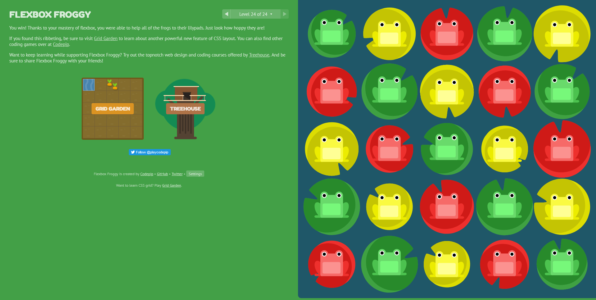

# Flexbox and JavaScrip Templating Language and Engine

## Mustache.js with Node and Express

* JavaScript templating is using data from JSON to render templates 'using JS' in the user end side.
* Mustache is a logic-less template syntax , that use only tags and no if else or any other logic-function used in it.
* Mustache.js is an implementation of mustache in js.
* Mustache is a specification for a templating language and not a templating engine, you can use the specification to implement Mustache in any PL.

* if you intend you use mustache with Node and Express, you can use mustache-express.

### usefull links

1. [Sherlynn Tans essay](https://1sherlynn.medium.com/javascript-templating-language-and-engine-mustache-js-with-node-and-express-f4c2530e73b2)
2. [Mustache specification](http://mustache.github.io/)
3. [Mustache.js](https://github.com/janl/mustache.js)
4. [Mustache-Express](https://www.npmjs.com/package/mustache-express)

****

## FlexBox

* Flexbox layout provide more efficient way to layout.

* Flexbox give the container the ability to alter its items’ width,height and order to best fill the available space.

* Most importantly, the flexbox layout is direction-agnostic as opposed to the regular layouts.

* Flexbox is a whole module and not a single property, it involves a lot of things including its whole set of properties.

> <https://css-tricks.com/wp-content/uploads/2018/11/00-basic-terminology.svg>

* Main axis is not always horzintal it depends on the `flex-direction` property.

* `flex-wrap : nowrap | wrap | wrap-reverse` used to make the items of the flex box to be in more than one line(default or `no-wrap`).

* Flexbox requires some vendor prefixing to support the most browsers possible.

### usefull link

1. [article](https://css-tricks.com/snippets/css/a-guide-to-flexbox/).
2. [Autoprefixer](https://css-tricks.com/autoprefixer/).

****

## Flex Froggy

