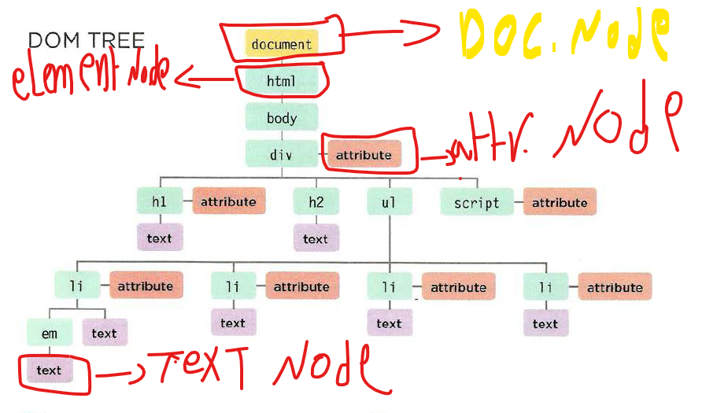

# Class-06

## Problem domain

* putting a fixed easy to solve problem domain helps people to focus on the other learning materiels.

* problem domains are difficult to understand , its got a lot of topics to cover and a lot of problems to solve with in it  and some of those could be blurry and ambagious.

* dividing the problem into smaller ones would help to ease understanding the problem domain.

* communicating more with the clients will give more information about the product and its problem domain.

***

## Objects literals

* there is a new way to create an object ; Follow the example below to illustrate it.

```JS
var Car = new object();
car.weight = 1400;
car.color = 'Black';
car.speed = 'Fast';
car.checkSpeedColor = function() {
return car.speed - car.color;
}
```

1. `new Object()` is how you declare that this `var` is an object.

2. `car.color` is a key that well be added to object.

3. `Black` is that key, value so together the will be key-value declaration or an **property** added to the object.

4. `car.checkSpeedColor` is a function within an variable embedded in an object or a **method**.

***

* to add property to an object you can use `car.color = 'Black';`, if the property does not exist.

* to update property use `car['speed'] = 'so slow';` if it does not exist it will create it for you and place that value in it.

***

## The Document Object Model (DOM)

DOM describe how the HTML model of a page is created and how JS can access  and update content of the page while its in browser window -Application Programming Interface (API).-.

**DOM tree** is a model of the webpage.


> Page 186 from the book JS Duckett.

* document node: represents the entire page
* element node : represents the HTML elements that describes tha page.
* attribute node: represents thats those elements carries an attributes
* text node : texts inside the elements  they cant have children nodes .

***

### Accessing nodes with JS

Similar to CSS selector there is methods inside js(DOM quires) to select HTML elements for example:

1. `getElementById('idValue')` targets an element by its `id` value which is suppose to be unique.

2. `querySelector ()` uses CSS selector and returns the first matching value.

Working with elements can be then done by using other methods.

***

