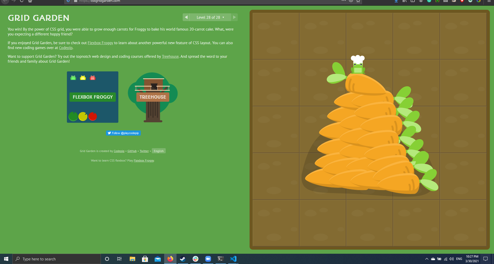

# CSS Grid

`display:grid` is an display property used to organize big layouts easily.

* `grid-column-start` used to move elements across the grids columns.

* `grid-column-start` with `grid-column-end` can be used to spread the element across multiple columns.

* `span` can be used with them to use relative position .

* `grid-row-start` used to move elements across the grids rows.

* `grid area` is a short hand for all of the above . 

* `order` changes the element position and also push grid elements.

* `grid-template-columns` and `and grid-template-rows` used to set the grid in the targeted container element.

* the fractional fr. Each fr unit allocates one share of the available space. For example, if two elements are set to 1fr and 3fr respectively, the space is divided into 4 equal shares; the first element occupies 1/4 and the second element 3/4 of any leftover space.

***

